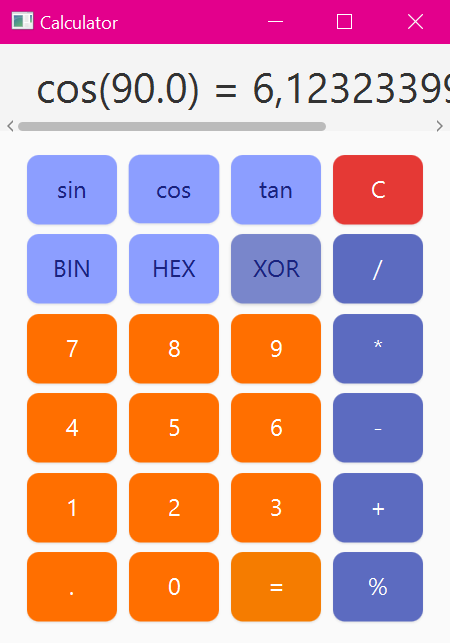

# Scientific Calculator
*A precise, responsive, and visually polished calculator built with Kotlin, JavaFX, and Gradle*



---

## ✨ Features

- **Exact arithmetic** using `BigDecimal`
- **Live expression display**
- **Scientific functions**: `sin`, `cos`, `tan` (input in degrees)
- **Programmer tools**:
    - Bitwise `XOR` with integer validation
    - Base conversion: `BIN` (binary) and `HEX` (hexadecimal)
- **Smart UX behavior**:
    - Seamless "unchaining": after `=`, pressing a digit starts a **new calculation**
    - Informative error messages (e.g., `"Division by zero"`)
    - Horizontal scrolling for long results (e.g., large binary strings)
- **Modern UI**:
    - Clean, responsive layout with full-width button container
    - External CSS for maintainable styling

---

## 🛠️ Tech Stack

| Component      | Technology                  |
|----------------|-----------------------------|
| Language       | Kotlin                      |
| UI Framework   | JavaFX                      |
| Build Tool     | Gradle (Kotlin DSL)         |
| Architecture   | MVVM (separated logic & UI) |
| Precision Math | `java.math.BigDecimal`      |

---

## 🚀 Getting Started

### Prerequisites
- JDK 17 or higher
- Git

### Build & Run
```bash
# Clone the repository
git clone https://github.com/reishasholihah/kotlin_calculator.git
cd kotlin_calculator

# Run with Gradle
./gradlew run
